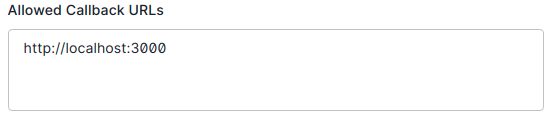

# Auth0 Starter - Client

This project contains the starter and finished code for a React App with OAuth authentication using [Auth0](https://auth0.com/).

Use this app in conjunction with the Auth0 starter server.

This project was bootstrapped with [Create React App](https://github.com/facebook/create-react-app).

## Routes
TBD

## Installation
TBD

## Auth0 Setup
1. Sign up for an Auth0 Account: https://auth0.com/signup

2. We'll be following the the quickstart documentation for a React SPA at this URL: https://auth0.com/docs/quickstart/spa/react/01-login

3. Notably, we'll want to create an "Application" on the Auth0 dashboard, under "Applications" > "Applications". We will want to configure:

* Application Type:
    * Single Page Application
    

* Application Login URI
    * Keep this one blank

* Allowed Callback URLs
    * http://localhost:3000, and/or the URL of your hosted client app
    

* Allowed logout URLs
    * http://localhost:3000, and/or the URL of your hosted client app
    

4. Next we'll register an API on the dashboard, following the documentation at this URL: https://auth0.com/docs/architecture-scenarios/spa-api/part-2

5. Configure an API in the menu found at "Applications" > "APIs"

* Identifier
    * Set it to your development server URL, such as http://localhost:8000
    