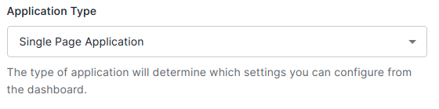
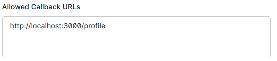
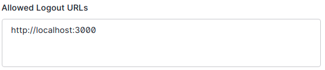
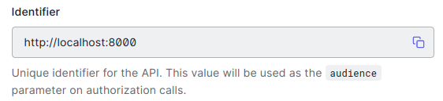

# Auth0 Starter - Client

This project contains the starter and finished code for a React App with OAuth authentication using [Auth0](https://auth0.com/).

Use this app in conjunction with the Auth0 starter server.

This project was bootstrapped with [Create React App](https://github.com/facebook/create-react-app).

## Auth0 Application Setup
1. Sign up for an Auth0 Account: https://auth0.com/signup

2. We'll be following the the quickstart documentation for a React SPA at this URL: https://auth0.com/docs/quickstart/spa/react/01-login

3. Notably, we'll want to create an "Application" on the Auth0 dashboard, under "Applications" > "Applications". We will want to configure:

* Application Type:
    * Single Page Application

    

* Application Login URI
    * Keep this one blank

* Allowed Callback URLs
    * http://localhost:3000, and/or the URL of your hosted client app

    

* Allowed logout URLs
    * http://localhost:3000, and/or the URL of your hosted client app
    
    

## React Setup
1. Install the Auth0 react SDK:
* `npm install @auth0/auth0-react`

2. Configure Auth0Provider component in `index.js`
https://auth0.com/docs/quickstart/spa/react/01-login#configure-the-auth0provider-component

```js
import { Auth0Provider } from '@auth0/auth0-react'

ReactDOM.render(
  <React.StrictMode>
    <Auth0Provider
      domain="domain from the application page"
      clientId="clientid from the application page"
      redirectUri={window.location.origin + '/profile'}
      audience={process.env.REACT_APP_SERVER_URL}
    >
      <App />
    </Auth0Provider>
  </React.StrictMode>,
  document.getElementById('root')
);
```
2. Add login to the `Navbar.jsx`
https://auth0.com/docs/quickstart/spa/react/01-login#add-login-to-your-application

3. Add logout to `Navbar.jsx`
https://auth0.com/docs/quickstart/spa/react/01-login#add-login-to-your-application

4. Add user profile info to `Profile.jsx`
https://auth0.com/docs/quickstart/spa/react/01-login#show-user-profile-information

5. Implement better redirects when you try to access a protected route
https://auth0.com/docs/libraries/auth0-react#protect-a-route

6. Implement conditional rendering for `Navbar.jsx`

7. Implement conditional rendering for `Home.jsx`

## Auth0 API Setup
1. Next we'll register an API on the dashboard, following the documentation at this URL: https://auth0.com/docs/architecture-scenarios/spa-api/part-2

2. Configure an API in the menu found at "Applications" > "APIs"

* Identifier
    * Set it to your development server URL, such as http://localhost:8000

    